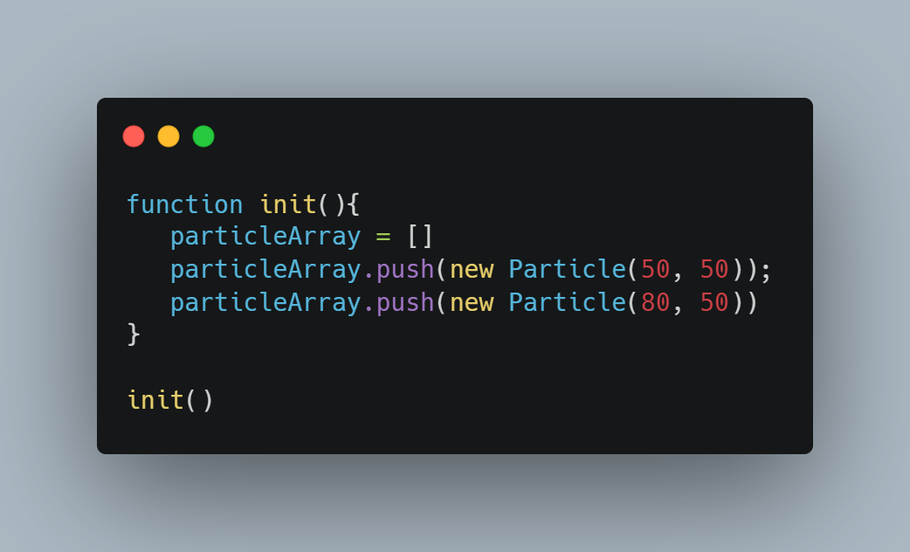

# Particles Canvas

- Tuto D'initiation au animation avancer avec Canvas / JS.

# Fiche Explicative

## Etape 1

========

- On créer trois fichier:

1. Html : on mette la balise Canvas avec un "id" Canvas 1
2. Css : Propriéter basique
3. Js : Script de notre animation

## Etape 2

### 1 Dans le scrpit JS:

    on créer la Variable (Const), on récupere cette ID avec la méthod **getElementbyid()**

### 2 Création de la variable

- On créer la variable **ctx** lui donnant pour valeur **canvas. getContext('TypeDeContexte')**. On indique le contexte dans le quel on veut dessiner. Avec les Variable **canvas.width = window.innerWidth / canvas.height = window.innerHeight** on créer la fenêtre de notre de notre animation.

- puis la variable **particleArray** qui prend un tableau vide. qui contiendra nos particules , la taille , la couleur et les coordonnés

### 3 On créer un objet personnalisé

- pour l'intéraction avec la souris, une valeur pour **l'axe X** , **l'axe Y**, le **raduis** de dispertion .

### 4 On créer l'écouteur d'évenement avec la méthode

- **addEventListener** pendra en paramètre "mousemove" et une fonction callback, c'est a dire que à chaque fois qu'on déplacera la souris on récupère la position X et Y de notre souris. Dans la fonction callback on lui passe un paramètre **event** et on récupère les donnée de notre objet personnalisé.
  **window.addEventListener("mousemove", function (event){ mouse.x = event.x; mouse.y = event.y;}**

- faire une console log(mouse.x , mouse.y)

### 5 On définie les propriéter de Font Canvas Style:

1. ctx.font : 'taille de la police en px, type de police'
2. ctx.fillText 'text afficher valeurX, valeur Y'
3. ctx.strokeStyle('couleur')
4. ctx.strokeRect(posx, posy, largeur , hauteur)
5. créer la variable **const textCoordiante**, qui prends en valeur la variable context et prends la methode **getImageData()**
   [Méthode: getImageData](https://developer.mozilla.org/fr/docs/Web/API/CanvasRenderingContext2D/getImageData) et [l'interface: ImageData](https://developer.mozilla.org/fr/docs/Web/API/ImageData)

### 6 Création de la classe Particules

1. On creer la class Particules dans le constructor on lui passe en paramètre _x_ et _y_ puis on créér nos particules avec l'attribu _this_.

- this.x = x: sera le placement des particules sur l'axeX.
- this.y = y : sera le placement des particules sur l'axeY.
- this.size = 3 : sera la taille en px de nos particules.
- this.baseX = Conservera la position de base des particules sur l'axeX.
- this.baseY = Conservera la position de base des particules sur l'axeY.
- this.density = Math.random()* 30 + 1: definie le poids et la vitesse *random situé entre 1 et 30\* de dispertion des particles lorsque la souris s'éloigne.

2. On l'instance de classe _draw_ qui affichera le cercle qui dispersera les particules.

- Crééer un cercle avec des canvas, par convention on utilise _ctx_ pour nom de variable:

1.  ctx.fillStyle : La propriété CanvasRenderingContext2D.fillStyle
    de l'API Canvas 2D spécifie la couleur ou style à utiliser à
    l'intérieur des formes. La valeur par défaut est #000 (black).

2.  ctx.beginPath(): réinitialise les chemin, en vidant le cache.
3.  ctx.arc(): prend en paramètre(posx, posy, angle de départ, angle  
    de fin): Ici on lui donne sa position x et Y avec this.xetY,

    this.size est le rayon du cercle. _0_ et la position de départ de la forme, et l'angle de fermeture avec la méthode **Math.PI\*2** qui est une valeur en radiant crée un cercle de 0 a 360 degres

4.  ctx.closePath(): permet la fermeture de notre forme.
5.  ctx.fill(): Remplis le chemin de notre tracée.

### 7 Fonction Init (Parti du code qui sera effacer, permet de comprendre comment les particules bouges avec de la physique basique(dispersion, etc...), l'animation des particules)

- la fonction Init est utilisée pour afficher nos particules dans le DOM. le code si aprés sera remplacé.
  .

- aprés a voir créer la fonction Init: on créer le tableau vide \*particleArray = []\*
- puis on lui passe la method **push()** qui prendra tous ce qu'on lui passera et le positionnera à la fin du \*tableau. Dans la méthode en lui passe en paramètre _new Particle()_ _qui prends les coordonnée X et Y._
  _- Le code_ : **particleArray.push(new Particle(50, 50))**

### 8 fonction animate

- on creer la fonction animate avec a l'intérieur de la fonction on lui donne la variable **ctx** avec la method **clearRect()**
- clearRect : efface tous les canvas en chaque image d'animation, i l prends en paramètre la*posX et pos Y largeur et hauteur*
- On créer une boucle for pour parcourir l'ensemble du tableau **particleArray**, dans la boucle on appel notre tableau avec l'index du tableau particleArray[i].draw()_ suivi de la methode \_draw()_

- on utilise la methode **window.requestAnimationframe()** qui permet de notifie au navigateur que l'on souhaitez exécuter une animation et demande que celui-ci exécute une fonction spécifique de mise à jour de l'animation, avant le prochain rafraîchissement du navigateur. Cette méthode prend comme argument un callback qui sera appelé avant le rafraîchissement du navigateur, et on lui passe en argument callback la fonction **animate**.

### 9 Affichage des particules

- .

- dans ce code on affiche les particules en dure pour pouvoir en afficher en grand nombre et aléatoirement on va créér un **variable x et y** et afficher un nombre random de particules multiplié par le nombre de particules voulu * par la hauteur et la largeur de notre canvas, puis passe dans nottre *new Particle(x, y)\* les paramètre X et Y.

- .

### 10 Update des particules

- On va creer une méthode _update_ qui consiste à calculer la distance entre la position actuelle de la souris et la position actuelle des particules.

## Calcule la distance entre deux points

- on va calculer la distance entre deux point sur l'axe X.
  on crée une variable _dx_ et on lui passe la posX de la souris _mouse.x_ moins la positionx initiale de la particule _this.x_.
  _let dx = mouse.x - this.x_

  - ex: si la pos x de la souris et a _50_ et la positionx de la particules et de _30_ alors dx = _20_. _this.y et this.x représente la position des particules_ on fais la même chose pour Y: _let dy = mouse.y - this.y_.

  - maintenant que nous connaissons la distance X et Y des particule par rapport a la position X et Y de la souris, nous venons de créer un angle droit entre la souris et la particules.
    nous avons donc un _coté adjacent dx et un coté opposée dy_ pour connaitre l'hypoténus.

  - pour calculer la distance on créer un variable distance qui sera égale _distX _ distX + distY _ distY_.
    _let distance = Math.sqrt(dx x dx + dy x dy)_.

  nous avons maintenant:

  - .

- on dis que si la distance "_hypothénus_" et inferieur a 500, la position initiale de nos particules _this.size_ est égale a 50 sinon sa position initiale reste a 3, pour finir on rappel notre tableau _particleArray[i].update_ dans notre fonction animate.

### 11 Dispertion des particules

- Maintenant que les particules sont suffisamment proche de la souris, on veut quel commence a s'éloigner. les particules vont ce déplacer du centre du cercle ver le bord, elle déplaceront à vitesse differentes en fonction de leurs poids. on veut aussi que les particules se déplace rapidement si elle sont proche de la souris mais qu'elles ralentissent progressivement à mesure qu'elles se rapproche de zonne d'extraction.

  1 . on créer un variable _forceDirectionX_ qui se ra egale _dx_ divisé par la _distance_ on fais de même pour la _forceDirectionY_
